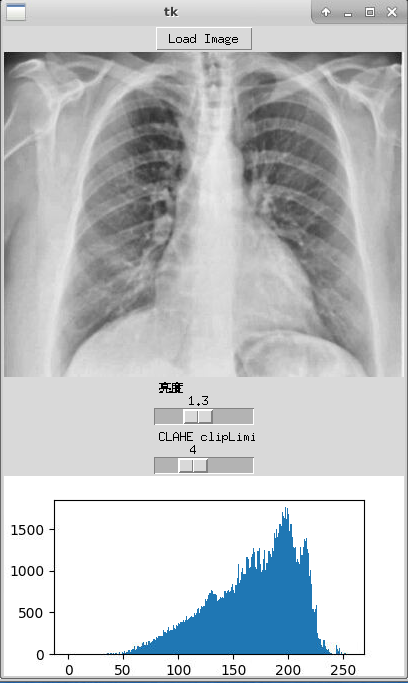

# 图像亮度和对比度调整APP
使用Python和Tkinter创建一个简单的图形用户界面，可以调整图像的亮度和对比度，并始终显示并更新直方图。

## 项目描述
本项目使用Python的图形用户界面库Tkinter，图像处理库Pillow和OpenCV，以及Matplotlib绘图库，实现了一个简单的图像编辑器。用户可以通过此编辑器打开本地图片文件，通过滑动条调整图片的亮度和对比度，并查看调整后的直方图。具体功能如下：

- 载入本地图片
- 调整图片亮度
- 调整图片对比度
- 显示调整后的直方图

## 项目运行效果截图


## 功能

### 载入本地图片
通过点击 "Load Image" 按钮，选择本地图片文件，载入编辑器。

### 调整图片亮度
通过拖动 "亮度" 滑块，实时调整图片的亮度。

### 调整图片对比度
通过拖动 "CLAHE clipLimit" 滑块，实时调整图片的对比度。

### 显示调整后的直方图
在调整图片亮度和对比度时，实时更新图片的直方图。

## 依赖
- Python 3.6+
- Pillow
- OpenCV
- Tkinter
- Matplotlib

## 使用
1. 运行项目：
```
python adjust_image_app.py
```

## 注意
- 由于GUI库Tkinter的限制，此项目仅支持在Python解释器下运行，不支持Jupyter Notebook或者其他交互式环境。

## 个人信息
- 学号: 202152320203
- 年级: 2021
- 专业: 智能科学与技术
- 班级: 智能科学与技术二班